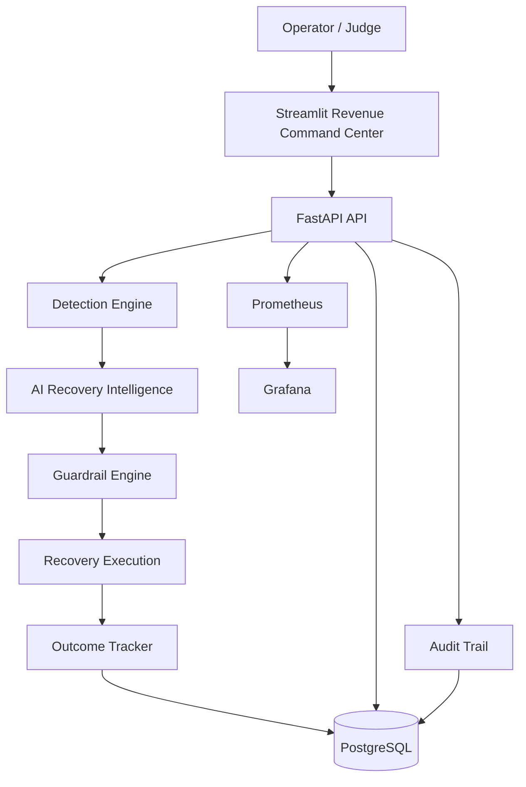
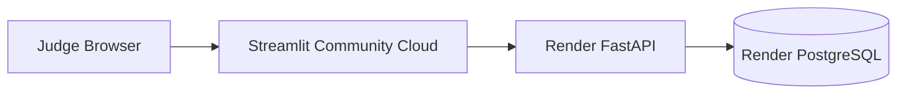

# Revenue Reliability

## AI-Powered Revenue Recovery & Autonomous Revenue Reliability Platform

> **Find revenue that is slipping away. Decide what to do. Recover it safely. Verify the outcome.**
> 


Revenue Reliability is an AI-driven revenue recovery platform that treats **failed payments and abandoned checkouts as revenue reliability incidents**.

Instead of simply reporting that a payment failed, the platform determines **how much revenue is at risk, why the incident occurred, whether recovery is possible, which intervention should be used, whether that intervention is safe to execute, and whether revenue was actually recovered.**

The result is a **Revenue Command Center** that connects AI decision-making, autonomous recovery, reliability engineering, observability, and financial impact in one system.

---

## Live Demo

| Resource              | Link                                                           |
| --------------------- | -------------------------------------------------------------- |
| **Live Application**  | https://revenue-recovery-8akyl9o9ea3pykmaq7nhg9.streamlit.app/ |
| **FastAPI Backend**   | https://revenue-recovery-apii.onrender.com                     |
| **API Health Check**  | https://revenue-recovery-apii.onrender.com/health              |
| **GitHub Repository** | https://github.com/Manasvisingh12/Revenue-recovery             |

**Primary judge-facing URL:**
https://revenue-recovery-8akyl9o9ea3pykmaq7nhg9.streamlit.app/

The Streamlit application is the primary interface for the project. The FastAPI backend and PostgreSQL database are deployed independently in the cloud, so the public application does not depend on the developer's local machine.


---

# The Problem

Payment failures and checkout abandonment are usually treated as isolated transaction errors.

At scale, however, they become a **revenue reliability problem**.

A merchant needs to know:

1. **Which revenue is currently at risk?**
2. **Which incidents are actually recoverable?**
3. **What intervention should be attempted?**
4. **Is the intervention safe to execute?**
5. **Did the intervention actually recover revenue?**

Traditional monitoring can tell engineering teams that a payment gateway or API is experiencing failures.

It does not necessarily answer:

> **"How much money is being lost, what should we do about it, and did our intervention work?"**

Revenue Reliability is designed to close that gap.

---

# The Solution

Revenue Reliability converts revenue incidents into structured recovery cases and moves them through an automated recovery pipeline.

```text
Payment / Checkout Event
          |
          v
      Detection
          |
          v
 Incident Classification
          |
          v
 AI Recovery Intelligence
          |
          v
    Safety Guardrails
          |
          v
   Recovery Execution
          |
          v
   Outcome Verification
          |
          v
 Revenue + Reliability Metrics
```

The system follows a principle of **bounded autonomy**.

AI can recommend and execute recovery actions, but execution is controlled by explicit safety mechanisms including:

* Retry limits
* Recovery budgets
* Customer consent checks
* Contact limits
* Duplicate recovery protection
* Circuit breaker controls
* Human escalation
* Audit logging

---

# Revenue Command Center

The Revenue Command Center provides an operational view of revenue exposure, AI decisions, recovery performance, and system reliability.

## Current Demo Metrics

| Metric                  |  Current Value | Meaning                                                     |
| ----------------------- | -------------: | ----------------------------------------------------------- |
| **Revenue at Risk**     | **₹13,02,585** | Revenue currently exposed across detected recovery cases    |
| **Recovered Revenue**   |    **₹18,990** | Revenue successfully recovered through simulated recovery   |
| **Recovery Success**    |       **100%** | Successful recovery attempts / successful recorded outcomes |
| **Recovery Attempts**   |         **10** | Recovery attempts that produced recorded outcomes           |
| **Successful Outcomes** |         **10** | Recovery attempts that successfully recovered revenue       |
| **Failed Outcomes**     |          **0** | Recorded recovery outcomes that failed                      |
| **Circuit Breaker**     |     **CLOSED** | Recovery execution is currently permitted                   |

> **Note:** This is a controlled simulation environment. Recovery amounts represent simulated recovery execution and do not involve real customer payments.

---

# AI Recovery Intelligence

The intelligence layer does not apply the same action to every revenue incident.

Each recovery case is evaluated using signals including:

* Failure classification
* Recovery opportunity score
* Recovery probability
* Expected recovery value
* AI confidence
* Incident context
* Customer and transaction information
* Safety constraints

The system then routes the case toward an appropriate intervention.

## Current AI Decision Distribution

| Recommended Action |   Cases | Purpose                                                   |
| ------------------ | ------: | --------------------------------------------------------- |
| **MESSAGE**        | **121** | Contact the customer through a recovery/payment-link flow |
| **WAIT**           |  **60** | Delay intervention when immediate action is not optimal   |
| **NO_ACTION**      |  **24** | Avoid unnecessary intervention                            |
| **RETRY**          |  **10** | Attempt automated payment recovery                        |
| **ESCALATE**       |  **10** | Route review-required cases to a human                    |
| **STOP**           |   **0** | Explicitly prevent recovery execution                     |
| **Total**          | **225** | Total recovery cases evaluated                            |

This distribution demonstrates that the system is **making differentiated recovery decisions rather than blindly retrying failed transactions**.

---

# Recovery Intelligence Example

Each recovery case contains a detailed intelligence profile.

### Example Case

```text
Case ID
case_641693148d7d

Amount
₹1,999

Status
AT_RISK

Classification
SOFT_FAILURE

AI Decision
MESSAGE

Recovery Score
60.00

Expected Recovery Value
₹1,599

AI Confidence
88%

Recovery Probability
80%
```

The investigation interface also exposes:

* AI diagnosis
* Decision reasoning
* Incident classification
* Recommended intervention
* Recovery probability
* Expected recovery value
* Execution state
* Recovery outcome

This allows an operator to understand **why a decision was made**, rather than treating the AI as a black box.

---

# End-to-End Revenue Recovery Pipeline

| Stage                  | Component             | Responsibility                              |
| ---------------------- | --------------------- | ------------------------------------------- |
| **01 — Events**        | Event Simulation      | Generate payment and checkout activity      |
| **02 — Detection**     | Detection Engine      | Detect failures, abandonment, and incidents |
| **03 — AI Decision**   | Recovery Intelligence | Classify risk and recommend intervention    |
| **04 — Guardrails**    | Guardrail Engine      | Validate whether the action is safe         |
| **05 — Execution**     | Recovery Executor     | Execute the permitted recovery workflow     |
| **06 — Outcome**       | Outcome Tracker       | Verify and persist recovery results         |
| **07 — Observability** | Prometheus / Grafana  | Monitor system and recovery behavior        |
| **08 — Audit**         | Audit Trail           | Preserve decision and execution history     |

The complete lifecycle is:

```text
DETECT
   ↓
UNDERSTAND
   ↓
DECIDE
   ↓
PROTECT
   ↓
EXECUTE
   ↓
VERIFY
   ↓
OBSERVE
```

---

# Guardrails & Revenue Reliability

The core idea behind the project is:

> **AI should never have unrestricted access to execute financial recovery actions.**

Every proposed intervention passes through a guardrail layer.

## Safety Controls

| Guardrail                   | Purpose                                                            |
| --------------------------- | ------------------------------------------------------------------ |
| **Circuit Breaker**         | Stops recovery execution when system safety conditions deteriorate |
| **Retry Limits**            | Prevents excessive repeated payment attempts                       |
| **Recovery Budget**         | Limits recovery execution exposure                                 |
| **Contact Limits**          | Prevents excessive customer contact                                |
| **Consent Check**           | Ensures customer consent requirements are respected                |
| **Already Recovered Check** | Prevents duplicate recovery attempts                               |
| **Human Escalation**        | Routes sensitive cases for manual review                           |
| **Audit Trail**             | Records AI decisions, guardrail evaluations, and execution events  |

### Bounded Autonomy

```text
             AI Recommendation
                    |
                    v
             Guardrail Engine
              /      |      \
             /       |       \
           ALLOW    BLOCK    ESCALATE
             |        |          |
             v        v          v
         Execute     Stop     Human Review
```

This separation between **decision** and **permission to execute** is one of the central reliability principles of the system.

---

# Recovery Execution

The current demo implements controlled recovery execution.

For permitted `RETRY` cases:

```text
Recovery Case
     |
     v
Guardrail Validation
     |
     v
RETRY Approved
     |
     v
Simulated Payment Recovery
     |
     v
RecoveryOutcome Created
     |
     v
Case → RECOVERED
```

The system then records:

* Recovery action
* Recovery status
* Recovered amount
* Case state
* Execution result
* Completion timestamp
* Audit information

A recovery is therefore not considered successful simply because an action was triggered.

**Success requires a recorded recovery outcome.**

---

# Observability

Revenue Reliability includes an observability layer designed around both **engineering reliability and financial impact**.

```text
                    FastAPI
                       |
                       v
                 Prometheus
                       |
                       v
                    Grafana
```

Prometheus-compatible metrics are exposed by the FastAPI service for monitoring:

* Recovery latency
* Recovery execution
* Guardrail events
* AI decisions
* Recovery outcomes
* System behavior

Grafana provides the operational monitoring layer, while the Streamlit Revenue Command Center surfaces the most important business-facing metrics.

---

# Architecture



---

# Production Deployment Architecture

The public application is deployed using separate cloud services.



### Deployment Responsibilities

| Service                       | Responsibility                 |
| ----------------------------- | ------------------------------ |
| **Streamlit Community Cloud** | Public Revenue Command Center  |
| **Render**                    | FastAPI backend                |
| **Render PostgreSQL**         | Persistent production database |
| **Prometheus**                | Metrics and observability      |
| **Grafana**                   | Operational monitoring         |
| **Docker Compose**            | Local development environment  |

The public application does not require:

* VS Code
* Docker Desktop
* A locally running FastAPI server
* A locally running PostgreSQL database

The deployed Streamlit application communicates with the deployed FastAPI service.

---

# Technology Stack

| Layer                | Technology                | Role                                           |
| -------------------- | ------------------------- | ---------------------------------------------- |
| **Frontend**         | Streamlit                 | Revenue Command Center and investigation UI    |
| **Backend**          | FastAPI                   | REST API and orchestration                     |
| **Database**         | PostgreSQL                | Persistent revenue and recovery data           |
| **ORM**              | SQLAlchemy                | Database models and access                     |
| **Migrations**       | Alembic                   | Database schema versioning                     |
| **AI / Decisioning** | Python                    | Classification, scoring and recovery decisions |
| **Reliability**      | Guardrail Engine          | Safe autonomous execution                      |
| **Metrics**          | Prometheus                | Application observability                      |
| **Dashboards**       | Grafana                   | Operational monitoring                         |
| **Containers**       | Docker / Docker Compose   | Reproducible local environment                 |
| **Deployment**       | Render                    | Backend and database hosting                   |
| **Frontend Hosting** | Streamlit Community Cloud | Public application                             |

---

# Demo Dataset

The project uses a controlled simulator to reproduce realistic revenue-risk scenarios without processing real customer transactions.

## Dataset Overview

| Dataset                          |     Records | Description                                            |
| -------------------------------- | ----------: | ------------------------------------------------------ |
| **Payment Events**               |     **520** | Simulated payment attempts                             |
| **Checkout Sessions**            |     **200** | Simulated completed and abandoned sessions             |
| **Recovery Cases**               |     **225** | Revenue-risk cases generated by the detection pipeline |
| **Successful Recovery Outcomes** |      **10** | Simulated successful RETRY recoveries                  |
| **Recovered Revenue**            | **₹18,990** | Total simulated recovered value                        |

### Simulated Failure Conditions

The simulator includes scenarios such as:

* Insufficient funds
* Card expiry
* Gateway timeout
* Bank timeout
* Temporary authorization failures
* Unknown errors
* Duplicate events
* Checkout abandonment

This allows the recovery engine to be evaluated against different incident types rather than a single failure condition.

---

# Failure Engineering

A recovery system should not only work under normal conditions.

It should also demonstrate how it behaves when dependencies fail.

The project includes controlled failure injection and reset mechanisms for demonstration and reliability testing.

```text
Normal System
      |
      v
Inject Failure
      |
      v
System Detects Degradation
      |
      v
Guardrails / Reliability Controls
      |
      v
Recovery or Escalation
      |
      v
Reset Environment
```

This allows the project to demonstrate the connection between **technical reliability and financial impact**.

---

# Auditability

Every important stage of the recovery lifecycle is designed to be traceable.

The audit layer records events such as:

* AI decision
* Guardrail evaluation
* Recovery execution
* Execution result
* Recovery outcome
* Postmortem metadata

This provides an investigation trail for understanding:

```text
What happened?
     ↓
Why did it happen?
     ↓
What did the AI recommend?
     ↓
Was the action allowed?
     ↓
What was executed?
     ↓
Did revenue recover?
```

---

# Project Structure

```text
Revenue-recovery/
│
├── app/
│   ├── api/
│   │   └── API endpoints
│   │
│   ├── classification/
│   │   └── Failure classification
│   │
│   ├── detection/
│   │   └── Revenue incident detection
│   │
│   ├── failure_engineering/
│   │   └── Controlled failure injection
│   │
│   ├── pipeline/
│   │   └── End-to-end processing
│   │
│   └── recovery/
│       ├── guardrails/
│       │   └── Safety controls
│       │
│       ├── action_executor.py
│       │   └── Recovery execution
│       │
│       ├── ai_diagnosis.py
│       │   └── AI diagnosis
│       │
│       ├── decision_engine.py
│       │   └── Recovery decisioning
│       │
│       ├── outcome_tracker.py
│       │   └── Recovery outcome persistence
│       │
│       └── recovery_metrics.py
│           └── Recovery observability
│
├── simulation/
│   ├── generator.py
│   └── load_data.py
│
├── prometheus/
│   ├── prometheus.yml
│   └── alerts.yml
│
├── grafana/
│   └── provisioning/
│
├── streamlit/
│   ├── app.py
│   ├── api.py
│   └── styles.py
│
├── alembic/
│   └── versions/
│
├── Dockerfile
├── docker-compose.yml
├── backend-requirements.txt
└── README.md
```

---

# Local Development

## 1. Clone the repository

```bash
git clone https://github.com/Manasvisingh12/Revenue-recovery.git

cd Revenue-recovery
```

## 2. Start the backend stack

```bash
docker compose up --build
```

This starts the local services defined by the project.

## 3. Run database migrations

```bash
alembic upgrade head
```

## 4. Load demo data

```bash
python -m simulation.load_data
```

## 5. Run the API locally

```bash
uvicorn app.main:app --reload --host 0.0.0.0 --port 8000
```

FastAPI documentation:

```text
http://localhost:8000/docs
```

## 6. Run Streamlit locally

```bash
pip install -r streamlit/requirements.txt

streamlit run streamlit/app.py
```

For local development:

```text
API_BASE_URL=http://localhost:8000
```

### Security

Do not commit:

* Database passwords
* API keys
* Cloud credentials
* Environment secrets

Use environment variables or platform secret managers.

---

# Hackathon Demo Flow

The project is designed to be explained through a short operational story.

## 01 — Start at the Command Center

Show:

* Revenue at Risk
* Recovered Revenue
* Recovery Success
* Circuit Breaker
* AI decision distribution

The objective is to establish the financial impact immediately.

---

## 02 — Open a Recovery Case

Select a case and explain:

* Incident classification
* Recovery score
* Recovery probability
* Expected recovery value
* AI confidence
* AI diagnosis
* Decision reasoning

This demonstrates that the system is not simply displaying transaction data.

---

## 03 — Explain the Guardrails

Show that an AI recommendation does not automatically become an execution.

The action passes through:

```text
AI Decision
     ↓
Guardrail Validation
     ↓
Allowed / Blocked / Escalated
```

This is the key safety component of the platform.

---

## 04 — Demonstrate Recovery

Use a permitted `RETRY` case.

Show:

```text
AT_RISK
   ↓
RETRY
   ↓
SUCCESS
   ↓
RECOVERED
```

Then show the resulting recovered amount in the Command Center.

---

## 05 — Close With Observability

Explain how:

* Prometheus
* Grafana
* Audit logs
* Recovery outcomes
* Financial metrics

connect technical system reliability with revenue impact.

---

# What Broke and How We Recovered

Building the system exposed several real engineering failure modes.

These failures became part of the project's reliability story.

## Database Migration Failure

The initial migration chain did not create the `recovery_cases` table before later migrations attempted to modify it.

This caused deployment failure during database initialization.

### Resolution

The migration history was consolidated into a clean baseline schema migration.

The database was then migrated to the correct Alembic head and the required tables were verified.

---

## Recovery Execution Contract Mismatch

The guardrail processor originally called the recovery executor using an incompatible function signature.

### Resolution

The execution contract was aligned so that the guardrail processor passes the database session and recovery case expected by the executor.

---

## Recovery Outcomes Were Not Being Persisted

The initial recovery execution path could successfully execute a recovery action without consistently creating a `RecoveryOutcome` record.

This meant the case state could indicate execution while the financial observability layer still showed no recovered revenue.

### Resolution

The outcome tracker was integrated into successful RETRY execution.

The system now records:

```text
Recovery Attempt
      ↓
RecoveryOutcome
      ↓
Recovered Amount
      ↓
Case → RECOVERED
      ↓
Observability Metrics
```

This is an important design principle:

> **A recovery action is not the same thing as a recovery outcome.**

---

# Design Principles

## 1. Revenue as a Reliability Signal

Traditional SRE systems focus on uptime, latency, errors, and availability.

Revenue Reliability extends that thinking by asking:

> **How much financial value is affected by a technical incident?**

---

## 2. Bounded Autonomy

AI should be capable of making decisions without being given unrestricted execution authority.

Every recovery action is validated through safety controls.

---

## 3. Outcome-Driven Recovery

A recovery attempt should only be considered successful when the system can verify the resulting recovery outcome.

---

## 4. Explainability

Operators should be able to understand:

* Why the case was classified a certain way
* Why an action was recommended
* How confident the system was
* What the expected recovery value was
* Why an action was allowed or blocked

---

## 5. Observability by Design

Financial metrics and engineering metrics are captured as part of the recovery workflow rather than being treated as an afterthought.

---

# Limitations

This project is a hackathon implementation using a controlled simulation environment.

The current system does not process real customer payments.

Recovery actions are simulated to demonstrate the architecture and decision flow.

The AI recovery intelligence is also designed as a demonstrable decision engine rather than a production-trained model using a large historical payment dataset.

These choices keep the project safe, reproducible, and suitable for a hackathon environment.

---

# Future Work

A production implementation could extend the platform with:

* Live payment processor integrations
* Real-time webhook ingestion
* Historical ML models trained on recovery outcomes
* Real customer notification channels
* Merchant-specific recovery policies
* Customer-level recovery propensity models
* Real-time feature stores
* Multi-tenant authentication and authorization
* OpenTelemetry distributed tracing
* Advanced canary and rollback controls
* Recovery ROI analytics
* Cohort-level recovery intelligence
* Automated postmortem generation

---

# Project Status

## Hackathon-Ready MVP

The current implementation demonstrates the complete core loop:

```text
Detect
  ↓
Understand
  ↓
Decide
  ↓
Protect
  ↓
Execute
  ↓
Verify
  ↓
Observe
```

The platform combines:

* AI recovery intelligence
* Autonomous execution
* Reliability guardrails
* Revenue observability
* PostgreSQL persistence
* FastAPI APIs
* Streamlit operations UI
* Prometheus metrics
* Grafana monitoring
* Audit trails
* Controlled failure engineering

---

# Submission Summary

### Track

**Revenue Reliability / AI Revenue Recovery**

### Project

**Revenue Reliability — AI Revenue Recovery Command Center**

### What It Solves

Failed payments and abandoned checkouts create hidden revenue loss that traditional monitoring does not connect directly to business impact.

### What We Built

An autonomous, guardrailed revenue recovery platform that:

1. Detects revenue-risk events
2. Classifies the incident
3. Calculates recovery opportunity
4. Determines the appropriate intervention
5. Validates the action through safety guardrails
6. Executes permitted recovery actions
7. Verifies recovery outcomes
8. Exposes financial and reliability intelligence through a command center

### Primary Demo

https://revenue-recovery-8akyl9o9ea3pykmaq7nhg9.streamlit.app/

### GitHub

https://github.com/Manasvisingh12/Revenue-recovery

### Backend

https://revenue-recovery-apii.onrender.com

---

# Author

**Manasvi Singh**

B.Tech Computer Science & Engineering

Cloud Engineering | DevOps | SRE | AI

GitHub:
https://github.com/Manasvisingh12
