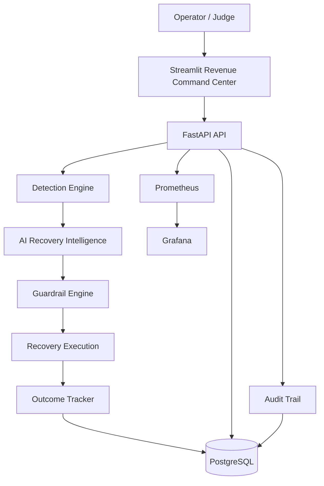
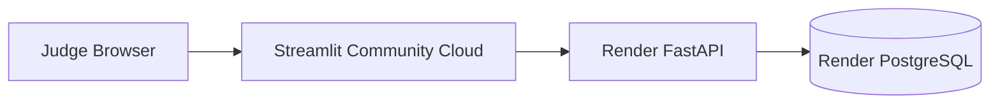

# Revenue Reliability — AI Revenue Recovery Platform

### A guardrailed, semi-autonomous system for finding, prioritizing, and recovering at-risk payment revenue


Revenue Reliability treats failed payments and abandoned checkouts as **revenue reliability incidents** rather than isolated transaction errors. For each incident, the platform works out how much revenue is at risk, why it happened, whether it's recoverable, which intervention to try, whether that intervention is safe to run, and whether it actually recovered the money.

All of that surfaces in a single Streamlit dashboard — the Revenue Command Center — alongside the AI's reasoning, the guardrails that gated each action, and the resulting observability metrics.

---

## Live Demo

| Resource | Link |
|---|---|
| **Live Application** | https://revenue-recovery-8akyl9o9ea3pykmaq7nhg9.streamlit.app/ |
| **FastAPI Backend** | https://revenue-recovery-apii.onrender.com |
| **API Health Check** | https://revenue-recovery-apii.onrender.com/health |
| **GitHub Repository** | https://github.com/Manasvisingh12/Revenue-recovery |

**Primary judge-facing URL:** https://revenue-recovery-8akyl9o9ea3pykmaq7nhg9.streamlit.app/

The Streamlit app is the primary interface. The FastAPI backend and PostgreSQL database are deployed independently in the cloud (Render), so the public app doesn't depend on the developer's local machine.

Additional views of the Revenue Command Center:


---

## The Problem

Payment failures and checkout abandonment are usually handled as isolated transaction errors. At scale, they add up to a revenue reliability problem — a merchant needs to know:

1. Which revenue is currently at risk?
2. Which incidents are actually recoverable?
3. What intervention should be attempted?
4. Is that intervention safe to execute?
5. Did it actually recover the revenue?

Standard monitoring can tell an engineering team that a payment gateway or API is failing. It doesn't answer *how much money is being lost, what to do about it, and whether the fix worked* — that's the gap this project is aimed at.

---

## The Solution

Revenue Reliability turns revenue incidents into structured recovery cases and moves them through an automated pipeline:

```text
Payment / Checkout Event
          |
          v
      Detection
          |
          v
 Incident Classification
          |
          v
 AI Recovery Intelligence
          |
          v
    Safety Guardrails
          |
          v
   Recovery Execution
          |
          v
   Outcome Verification
          |
          v
 Revenue + Reliability Metrics
```

AI can recommend and execute recovery actions, but only within explicit safety limits — retry limits, recovery budgets, customer consent checks, contact limits, duplicate-recovery protection, a circuit breaker, human escalation, and audit logging. The full guardrail layer is covered in [Guardrails & Safety Controls](#guardrails--safety-controls).

---

## Revenue Command Center — Demo Metrics

| Metric | Current Value | Meaning |
|---|---:|---|
| **Revenue at Risk** | **₹13,02,585** | Revenue currently exposed across detected recovery cases |
| **Recovered Revenue** | **₹18,990** | Revenue recovered through simulated recovery execution |
| **Recovery Success** | **100%** | Successful recovery attempts / recorded outcomes |
| **Recovery Attempts** | **10** | Recovery attempts that produced a recorded outcome |
| **Successful Outcomes** | **10** | Attempts that successfully recovered revenue |
| **Failed Outcomes** | **0** | Recorded outcomes that failed |
| **Circuit Breaker** | **CLOSED** | Recovery execution is currently permitted |

*These numbers come from a controlled simulation — no real customer payments are involved, and the sample size is small. See [Limitations](#limitations) before reading too much into the 100% figure.*

---

## AI Recovery Intelligence

Each recovery case is scored using signals including failure classification, a recovery opportunity score, recovery probability, expected recovery value, AI confidence, incident context, customer/transaction information, and the safety constraints in play. Based on those signals, the case is routed to an intervention:

| Recommended Action | Cases | Purpose |
|---|---:|---|
| **MESSAGE** | **121** | Contact the customer through a recovery/payment-link flow |
| **WAIT** | **60** | Delay intervention when immediate action isn't optimal |
| **NO_ACTION** | **24** | Avoid unnecessary intervention |
| **RETRY** | **10** | Attempt automated payment recovery |
| **ESCALATE** | **10** | Route review-required cases to a human |
| **STOP** | **0** | Explicitly block recovery execution |
| **Total** | **225** | Total recovery cases evaluated |

The spread across actions shows the system routing cases differently rather than retrying every failure the same way.

### Recovery Case Example

```json
{
  "case_id": "case_641693148d7d",
  "amount_inr": 1999,
  "status": "AT_RISK",
  "classification": "SOFT_FAILURE",
  "ai_decision": "MESSAGE",
  "recovery_score": 60.0,
  "expected_recovery_value_inr": 1599,
  "ai_confidence_pct": 88,
  "recovery_probability_pct": 80
}
```

The investigation view also exposes the AI's diagnosis, decision reasoning, incident classification, recommended intervention, execution state, and recovery outcome — so an operator can see *why* a decision was made rather than just what it was.

---

## End-to-End Pipeline

| Stage | Component | Responsibility |
|---|---|---|
| **01 — Events** | Event Simulation | Generate payment and checkout activity |
| **02 — Detection** | Detection Engine | Detect failures, abandonment, and incidents |
| **03 — AI Decision** | Recovery Intelligence | Classify risk and recommend an intervention |
| **04 — Guardrails** | Guardrail Engine | Validate whether the action is safe |
| **05 — Execution** | Recovery Executor | Execute the permitted recovery workflow |
| **06 — Outcome** | Outcome Tracker | Verify and persist the recovery result |
| **07 — Observability** | Prometheus / Grafana | Monitor system and recovery behavior |
| **08 — Audit** | Audit Trail | Preserve decision and execution history |

---

## Guardrails & Safety Controls

A core design constraint: AI can recommend a recovery action, but it never executes one without passing through the guardrail layer below.

| Guardrail | Purpose |
|---|---|
| **Circuit Breaker** | Stops recovery execution when system safety conditions deteriorate |
| **Retry Limits** | Prevents excessive repeated payment attempts |
| **Recovery Budget** | Caps recovery execution exposure |
| **Contact Limits** | Prevents excessive customer contact |
| **Consent Check** | Enforces customer consent requirements |
| **Already-Recovered Check** | Prevents duplicate recovery attempts |
| **Human Escalation** | Routes sensitive cases for manual review |
| **Audit Trail** | Records AI decisions, guardrail evaluations, and execution events |

### Bounded Autonomy

```text
             AI Recommendation
                    |
                    v
             Guardrail Engine
              /      |      \
             /       |       \
           ALLOW    BLOCK    ESCALATE
             |        |          |
             v        v          v
         Execute     Stop     Human Review
```

This split between *deciding* and *being allowed to act* is what keeps the AI from having direct, unchecked control over financial recovery actions.

---

## Recovery Execution

For a permitted `RETRY` case:

```text
Recovery Case
     |
     v
Guardrail Validation
     |
     v
RETRY Approved
     |
     v
Simulated Payment Recovery
     |
     v
RecoveryOutcome Created
     |
     v
Case -> RECOVERED
```

The system records the recovery action, status, recovered amount, case state, execution result, completion timestamp, and audit information. A recovery isn't counted as successful just because an action was triggered — it needs a recorded `RecoveryOutcome`.

---

## Observability

```text
                    FastAPI
                       |
                       v
                 Prometheus
                       |
                       v
                    Grafana
```

FastAPI exposes Prometheus-compatible metrics covering recovery latency, recovery execution, guardrail events, AI decisions, recovery outcomes, and general system behavior. Grafana handles operational monitoring; the Streamlit Command Center surfaces the business-facing numbers.

---

## Architecture



---

## Production Deployment Architecture



| Service | Responsibility |
|---|---|
| **Streamlit Community Cloud** | Public Revenue Command Center |
| **Render** | FastAPI backend |
| **Render PostgreSQL** | Persistent production database |
| **Prometheus** | Metrics and observability |
| **Grafana** | Operational monitoring |
| **Docker Compose** | Local development environment |

The public app doesn't require VS Code, Docker Desktop, or a locally running FastAPI/PostgreSQL instance — the deployed Streamlit app talks to the deployed FastAPI service directly.

---

## Technology Stack

| Layer | Technology | Role |
|---|---|---|
| **Frontend** | Streamlit | Revenue Command Center and investigation UI |
| **Backend** | FastAPI | REST API and orchestration |
| **Database** | PostgreSQL | Persistent revenue and recovery data |
| **ORM** | SQLAlchemy | Database models and access |
| **Migrations** | Alembic | Database schema versioning |
| **AI / Decisioning** | Python | Classification, scoring, and recovery decisions |
| **Reliability** | Guardrail Engine | Safety controls on execution |
| **Metrics** | Prometheus | Application observability |
| **Dashboards** | Grafana | Operational monitoring |
| **Containers** | Docker / Docker Compose | Reproducible local environment |
| **Deployment** | Render | Backend and database hosting |
| **Frontend Hosting** | Streamlit Community Cloud | Public application |

---

## Demo Dataset

A controlled simulator reproduces realistic revenue-risk scenarios without touching real customer transactions.

| Dataset | Records | Description |
|---|---:|---|
| **Payment Events** | **520** | Simulated payment attempts |
| **Checkout Sessions** | **200** | Simulated completed and abandoned sessions |
| **Recovery Cases** | **225** | Revenue-risk cases from the detection pipeline |
| **Successful Recovery Outcomes** | **10** | Simulated successful `RETRY` recoveries |
| **Recovered Revenue** | **₹18,990** | Total simulated recovered value |

Simulated failure conditions include insufficient funds, card expiry, gateway timeout, bank timeout, temporary authorization failures, unknown errors, duplicate events, and checkout abandonment — so the recovery engine is exercised against more than one failure type.

---

## Failure Engineering

The project includes controlled failure injection and reset mechanisms, so it can show how the system behaves when its own dependencies fail, not just under normal conditions:

```text
Normal System
      |
      v
Inject Failure
      |
      v
System Detects Degradation
      |
      v
Guardrails / Reliability Controls
      |
      v
Recovery or Escalation
      |
      v
Reset Environment
```

---

## Auditability

The audit layer records the AI decision, guardrail evaluation, recovery execution, execution result, recovery outcome, and postmortem metadata for each case, so an investigation can trace:

```text
What happened?
     |
Why did it happen?
     |
What did the AI recommend?
     |
Was the action allowed?
     |
What was executed?
     |
Did revenue recover?
```

---

## Project Structure

```text
Revenue-recovery/
│
├── app/
│   ├── api/                      # API endpoints
│   ├── classification/           # Failure classification
│   ├── detection/                # Revenue incident detection
│   ├── failure_engineering/      # Controlled failure injection
│   ├── pipeline/                 # End-to-end processing
│   └── recovery/
│       ├── guardrails/           # Safety controls
│       ├── action_executor.py    # Recovery execution
│       ├── ai_diagnosis.py       # AI diagnosis
│       ├── decision_engine.py    # Recovery decisioning
│       ├── outcome_tracker.py    # Recovery outcome persistence
│       └── recovery_metrics.py   # Recovery observability
│
├── simulation/
│   ├── generator.py
│   └── load_data.py
│
├── prometheus/
│   ├── prometheus.yml
│   └── alerts.yml
│
├── grafana/
│   └── provisioning/
│
├── streamlit/
│   ├── app.py
│   ├── api.py
│   └── styles.py
│
├── alembic/
│   └── versions/
│
├── Dockerfile
├── docker-compose.yml
├── backend-requirements.txt
└── README.md
```

---

## Local Development

### 1. Clone the repository

```bash
git clone https://github.com/Manasvisingh12/Revenue-recovery.git
cd Revenue-recovery
```

### 2. Start the backend stack

```bash
docker compose up --build
```

### 3. Run database migrations

```bash
alembic upgrade head
```

### 4. Load demo data

```bash
python -m simulation.load_data
```

### 5. Run the API locally

```bash
uvicorn app.main:app --reload --host 0.0.0.0 --port 8000
```

FastAPI docs: `http://localhost:8000/docs`

### 6. Run Streamlit locally

```bash
pip install -r streamlit/requirements.txt
streamlit run streamlit/app.py
```

For local development: `API_BASE_URL=http://localhost:8000`

### Security

Don't commit database passwords, API keys, cloud credentials, or other environment secrets — use environment variables or a platform secret manager.

---

## Demo Walkthrough

### 1. Start at the Command Center
Show revenue at risk, recovered revenue, recovery success rate, circuit breaker status, and the AI decision distribution — establish the financial impact first.

### 2. Open a Recovery Case
Walk through incident classification, recovery score, recovery probability, expected recovery value, AI confidence, diagnosis, and decision reasoning — this shows the system isn't just displaying transaction data.

### 3. Explain the Guardrails
Show that an AI recommendation doesn't automatically become an execution — it passes through guardrail validation and comes out allowed, blocked, or escalated. This is the platform's core safety mechanism.

### 4. Demonstrate Recovery
Use a permitted `RETRY` case and walk it from `AT_RISK` → `RETRY` → `SUCCESS` → `RECOVERED`, then show the recovered amount land in the Command Center.

### 5. Close with Observability
Show how Prometheus, Grafana, audit logs, recovery outcomes, and financial metrics connect technical reliability back to revenue impact.

---

## What Broke and How We Fixed It

Building this surfaced a few real engineering failures, which became part of the project's own reliability story.

### Database migration failure
The initial migration chain didn't create the `recovery_cases` table before later migrations tried to modify it, which broke database initialization on deploy.
**Fix:** consolidated the migration history into a clean baseline schema migration and verified the database against the correct Alembic head.

### Recovery execution contract mismatch
The guardrail processor originally called the recovery executor with an incompatible function signature.
**Fix:** aligned the contract so the guardrail processor passes the database session and recovery case the executor actually expects.

### Recovery outcomes weren't being persisted
The recovery execution path could successfully run a `RETRY` without reliably creating a `RecoveryOutcome` record — so a case could show as executed while the financial observability layer still showed zero recovered revenue.
**Fix:** wired the outcome tracker into the successful `RETRY` path, so every completed attempt now produces `Recovery Attempt → RecoveryOutcome → Recovered Amount → Case: RECOVERED → Observability Metrics`.

The underlying lesson: a recovery *action* is not the same thing as a recovery *outcome* — the system only counts the latter.

---

## Design Principles

1. **Revenue as a reliability signal.** Traditional SRE metrics (uptime, latency, error rate) don't say how much financial value an incident cost — this project ties technical incidents to a revenue number.
2. **Bounded autonomy.** The AI can decide; it can't execute without passing through the guardrail layer.
3. **Outcome-driven recovery.** A recovery attempt only counts as successful once the outcome is verified and recorded.
4. **Explainability.** An operator can see why a case was classified a certain way, why an action was recommended, how confident the system was, and why an action was allowed or blocked.
5. **Observability by design.** Financial and engineering metrics are captured as part of the recovery workflow itself, not bolted on afterward.

---

## Limitations

This is a hackathon build running against a controlled simulation, not live payment traffic. Worth being explicit about what that means in practice:

- No real payment gateway is integrated — the 520 payment events and 200 checkout sessions all come from the built-in simulator, not a live processor.
- The 100% recovery success rate is measured over 10 completed `RETRY` outcomes out of 225 total cases — a small sample from simulated data, not a statistically meaningful real-world recovery rate.
- The AI Recovery Intelligence layer is a rule/scoring-based decision engine, not a model trained on historical recovery outcomes — there's no feedback loop yet from past recoveries into future decisions.
- The `MESSAGE` action isn't wired to a real notification channel (SMS/email/WhatsApp) — it's a simulated intervention path.
- There's no multi-tenant auth: the deployed app doesn't separate data by merchant or restrict access, so it isn't ready to onboard a real merchant as-is.
- Failure injection and reliability testing are manually/demo-triggered rather than run as continuous chaos testing.
- Hosting is on Streamlit Community Cloud and Render — if those are on free-tier plans, expect cold starts and rate limits during a live demo.

*(Update this list as the real gaps close — it reflects the project as described here, not a live audit of the current repo.)*

---

## Future Work

- Live payment processor integrations
- Real-time webhook ingestion
- Historical ML models trained on recovery outcomes
- Real customer notification channels
- Merchant-specific recovery policies
- Customer-level recovery propensity models
- Real-time feature stores
- Multi-tenant authentication and authorization
- OpenTelemetry distributed tracing
- Advanced canary and rollback controls
- Recovery ROI analytics
- Cohort-level recovery intelligence
- Automated postmortem generation

---

## Project Status

The current build demonstrates the full loop — detect, classify, decide, guard, execute, verify, observe — end to end, combining AI recovery intelligence, guardrailed execution, PostgreSQL persistence, a FastAPI backend, a Streamlit operations UI, Prometheus metrics, Grafana monitoring, audit trails, and controlled failure engineering.

It's a hackathon-stage MVP: the core loop works and is demoable, but see [Limitations](#limitations) for what's still simulated or missing before this could handle real merchant traffic.

---

## Submission Summary

**Track:** AI Revenue Recovery
**Project:** Revenue Reliability — AI Revenue Recovery Command Center

**What it solves:** Failed payments and abandoned checkouts create revenue loss that standard monitoring doesn't connect directly to business impact.

**What we built:** A guardrailed revenue recovery platform that detects revenue-risk events, classifies the incident, scores the recovery opportunity, picks an intervention, validates it through safety guardrails, executes permitted recovery actions, verifies the outcome, and surfaces the financial and reliability picture in a command center.

**Primary demo:** https://revenue-recovery-8akyl9o9ea3pykmaq7nhg9.streamlit.app/
**GitHub:** https://github.com/Manasvisingh12/Revenue-recovery
**Backend:** https://revenue-recovery-apii.onrender.com

---

## Author

**Manasvi Singh**
B.Tech Computer Science & Engineering
Cloud Engineering | DevOps | SRE | AI

GitHub: https://github.com/Manasvisingh12
